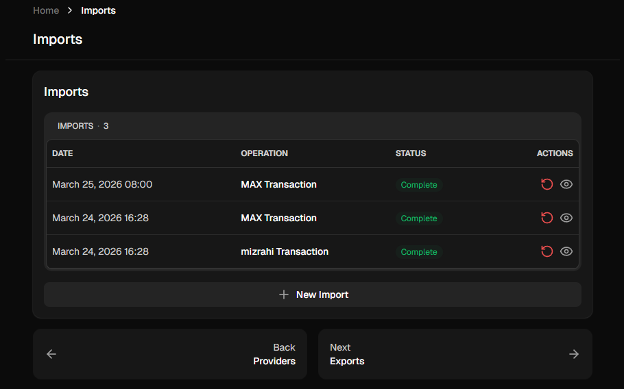
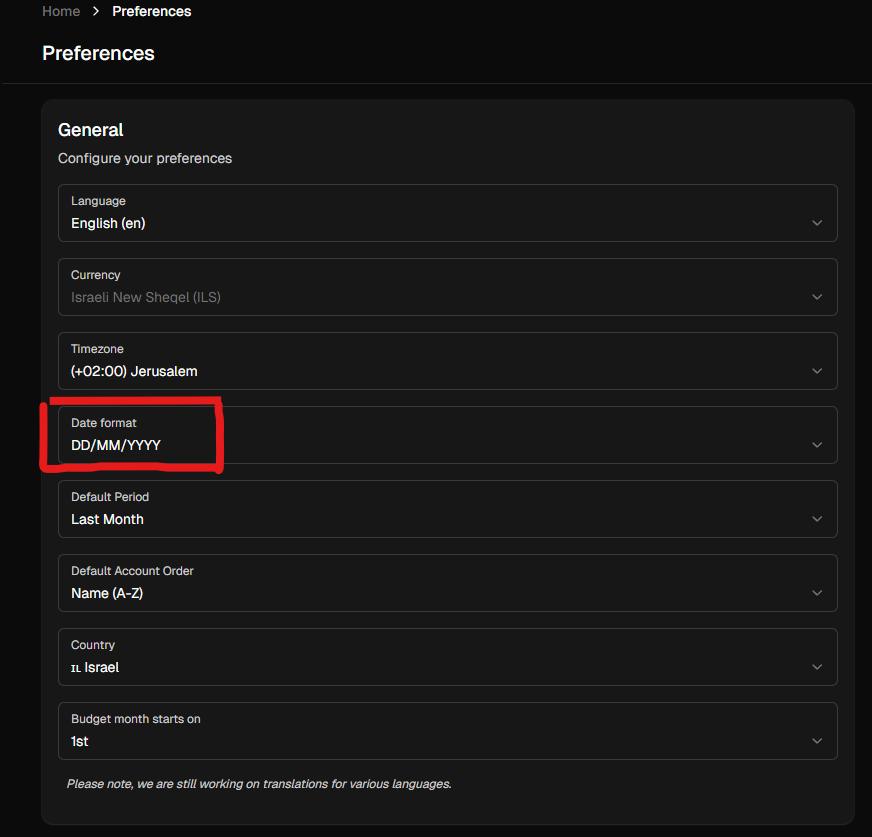

# israeli-banks-sure-importer

Automatically imports transactions from Israeli banks and credit cards into your
self-hosted [Sure Finance](https://github.com/we-promise/sure) instance.

Powered by [israeli-bank-scrapers](https://github.com/eshaham/israeli-bank-scrapers)
(v6.7.1) - scrapes Israeli banks via headless Chromium. Runs entirely on your homelab -
no cloud, no third-party services.

---

## How It Works

1. Scrapes your configured bank and credit card accounts using headless Chromium
2. Filters out zero-amount transactions, future-dated transactions, and already-imported transactions
3. Generates a CSV from new transactions only
4. Posts the CSV to Sure's Import API (`POST /api/v1/imports`)
5. When `PUBLISH=false` (default), the import lands in Sure's review queue - you
   inspect and confirm in the Sure UI before transactions appear
6. Once validated, set `PUBLISH=true` for fully automatic imports on every run

---

## Requirements

- Docker + Docker Compose
- A running [Sure Finance](https://github.com/we-promise/sure) instance
- A Sure API key (Settings → API in the Sure UI)
- Telegram bot token + chat ID (for failure alerts)

---

## Quick Start

### 1. Prerequisites — before you start

Make sure you have the following ready before touching a terminal:

- [ ] A running [Sure Finance](https://github.com/we-promise/sure) instance and its URL
      (e.g. `http://sure:3000`)
- [ ] A Sure API key — Sure UI → Settings → API Keys → New Key
- [ ] Your bank login credentials (username + password for each account you want to import)
- [ ] *(Optional)* A Telegram bot token + your chat ID for failure alerts
      - Bot token: create via [@BotFather](https://t.me/BotFather) on Telegram
      - Chat ID: send any message to your bot, then open
        `https://api.telegram.org/bot<TOKEN>/getUpdates` and read `"chat"."id"`
- [ ] A Sure account UUID for **each** bank — create them in Sure UI first:
      Sure → Accounts → New Account → select **Cash** (bank account) or **Credit Card**
      → open the account → Settings → copy the UUID

### 2. Clone the repo

```bash
git clone https://github.com/dorko87/israeli-sure-importer.git
cd israeli-sure-importer
```

All subsequent steps run from this directory.

### 3. Create your secret files

One file per credential — raw value only, no quotes, no trailing newline.

```bash
printf '%s' "your-sure-api-key"  > secrets/sure_api_key
printf '%s' "123456:ABC-DEF..."  > secrets/telegram_bot_token  # skip if no Telegram
printf '%s' "myusername"         > secrets/leumi_username
printf '%s' "mypassword"         > secrets/leumi_password
printf '%s' "myusername"         > secrets/max_username
printf '%s' "mypassword"         > secrets/max_password

chmod 400 secrets/*
```

Add one file per credential for each bank you configure. See `secrets/README.md` for
the full list of credential field names per bank.

### 4. Create your config

```bash
cp config.example.json config.json
```

Edit `config.json`:
- Set `sure.baseUrl` to your Sure instance URL
- Remove the example targets and add only the banks you use
- Paste each Sure account UUID (from Prerequisites) into the matching `sureAccountId` field

See [Configuration → config.json](#configjson) for the full schema.

### 5. Set up directories and copy merchants.json

```bash
mkdir -p cache browser-data logs
chown -R 1000:1000 cache browser-data logs
cp merchants.json logs/merchants.json
```

`merchants.json` maps raw bank descriptions to clean merchant names in Sure.
Edit `logs/merchants.json` at any time — it is re-read on every run without a restart.

### 6. Configure compose.yml

Open `compose.yml` and set your Telegram chat ID (if using Telegram):

```yaml
TELEGRAM_CHAT_ID: "123456789"   # paste your chat ID here
```

All other defaults are safe for first use. See
[compose.yml environment variables](#composeyml-environment-variables) for the full reference.

### 7. Test run

Pull the image and run once — transactions land in Sure's **review queue**, nothing
is auto-published:

```bash
docker compose pull
docker compose run --rm israeli-sure-importer node dist/index.js --run-once
tail -f ./logs/importer.log
```

**What success looks like in the log:**
```
[INFO]  [leumi] Scraped 28 tx → 9 new | CSV posted → import_id=abc123
[INFO]  [leumi] Import status: pending — review in Sure UI
[INFO]  === Run finished ===
```

Open Sure → Transactions → Imports → review the pending import → confirm it looks correct.

If you see errors, set `LOG_LEVEL: debug` in `compose.yml` and re-run for full detail.

### 8. Go live

Once you're happy with the first import:

1. Open `compose.yml` and set `PUBLISH: "true"` (auto-process future imports)
2. Start on schedule:

```bash
docker compose up -d
```

---

## Configuration

### `config.json`

Contains only structure - no credentials, no API keys. Safe to commit.

```jsonc
{
  "sure": {
    // Sure container URL - use container name if on same Docker network
    "baseUrl": "http://sure:3000"
  },
  "targets": [
    {
      // Label used in logs
      "name": "Leumi Checking",
      // CompanyTypes key from israeli-bank-scrapers
      "companyId": "leumi",
      // Maps credential field name → secret filename under secrets/
      "credentialSecrets": {
        "username": "leumi_username",
        "password": "leumi_password"
      },
      // UUID from Sure account settings - create the account in Sure UI first
      // Sure UI → Accounts → New Account → select type (Cash / Credit Card)
      // then copy the UUID from the account settings page
      "sureAccountId": "paste-uuid-from-sure-ui"
    },
    {
      "name": "Max Credit Card",
      "companyId": "max",
      "credentialSecrets": {
        "username": "max_username",
        "password": "max_password"
      },
      "sureAccountId": "paste-uuid-from-sure-ui"
    }
  ]
}
```

### `compose.yml` environment variables

| Variable | Default | Description |
|----------|---------|-------------|
| `LOG_LEVEL` | `info` | `error` / `warn` / `info` / `debug` |
| `SCHEDULE` | - | Cron expression. Remove entirely to run once and exit. |
| `DAYS_BACK` | `30` | Days to fetch on the very first run |
| `TIMEOUT_MINUTES` | `10` | Per-bank timeout (also sets Puppeteer defaultTimeout) |
| `PUBLISH` | `"false"` | `"false"` = review queue · `"true"` = auto-process |
| `DRY_RUN` | `"false"` | `"true"` = scrape only, no uploads to Sure |
| `IMPORT_PENDING` | `"false"` | `"true"` = include bank-pending transactions |
| `BROWSER_DATA_DIR` | `/app/browser-data` | Per-bank browser profile path. Remove to use fresh session every run. |
| `MERCHANTS_PATH` | `/app/logs/merchants.json` | Override path to `merchants.json`. |
| `NOTIFY_ON_LOGIN_FAIL` | `"true"` | Telegram alert on bank login failure |
| `NOTIFY_ON_SYNC_FAIL` | `"true"` | Telegram alert on sync failure. Note: slow-scrape warnings always fire regardless of this flag. |
| `NOTIFY_ERROR_THRESHOLD` | `0` | Telegram alert when failed tx count ≥ this |
| `NOTIFY_ON_SUCCESS` | `"false"` | Telegram summary on successful sync |
| `CACHE_DIR` | `/app/cache` | Override `state.db` directory |
| `HISTORY_PATH` | `/app/logs/import_history.jsonl` | Override import history log path |

### `merchants.json`

Optional merchant name overrides. Maps raw bank description strings to clean names
using fuzzy (contains) matching.

```json
[
  { "pattern": "רמי לוי",    "name": "Rami Levy" },
  { "pattern": "סונול",      "name": "Sonol" },
  { "pattern": "NETFLIX",    "name": "Netflix" },
  { "pattern": "HOT MOBILE", "name": "Hot Mobile" }
]
```

**Runtime location:** `./logs/merchants.json`
(served by the existing logs volume mount - no separate Docker mount needed)

Copy the repo's `merchants.json` to your logs directory before starting the container:
```bash
cp merchants.json ./logs/merchants.json
```

The file is re-read on every scheduled run - edit it directly on Unraid and changes
take effect on the next run without a container restart.

The raw bank description is always preserved in the `notes` field in Sure regardless
of whether a merchant match is found.

---

## Transaction Handling

### Zero-amount transactions

Transactions where the charged amount is exactly zero are **always skipped** and
never imported into Sure. These are bank-internal entries - authorization holds that
were released, fee reversals that cancelled out, or reconciliation artifacts. They
carry no financial value and would only create noise in your transaction list,
budgets, and reports.

### Duplicate prevention

The bridge tracks every imported transaction in a local SQLite database (`cache/state.db`).
On each run it checks new transactions against this database before building the CSV -
anything already imported is silently skipped.

The deduplication key is a SHA-256 hash built from:

- **Primary** (when the bank provides a transaction ID): `accountNumber + transactionId`
- **Fallback** (when no transaction ID is available): `accountNumber + date + amount + description + installmentNumber`

The installment number is deliberately included in the fallback key. Israeli banks
report installment payments with the same merchant name and amount every month -
without the installment number, payment 3 of 12 and payment 4 of 12 would look
identical and all but the first would be incorrectly skipped.

### What you see in Sure

| Sure field | Content | Example |
|------------|---------|---------|
| **Name** | Clean merchant name (from `merchants.json` if matched, otherwise raw description). No installment info - keeps Sure's Rules engine working correctly. | `קאנטרי קריית טבעון` |
| **Notes** | Additional context only - never duplicates what is already in Name. Plain transaction with no merchant match and no memo: empty. Plain transaction with merchant match: raw bank description (audit trail). Transfer transaction with bank memo (Paybox, Bit, etc.): memo text e.g. `"למי: Name, עבור: Purpose"`. Installment: installment label (`תשלום N מתוך M`) optionally followed by raw description if a merchant match was found. | `תשלום 3 מתוך 12 \| קאנטרי קריית טבעון` |

---

## Supported Banks

| Bank / Card | `companyId` | Credential fields |
|-------------|-------------|-------------------|
| Bank Hapoalim | `hapoalim` | `userCode`, `password` |
| Bank Leumi | `leumi` | `username`, `password` |
| Discount Bank | `discount` | `id`, `password`, `num` |
| Mercantile Bank | `mercantile` | `id`, `password`, `num` |
| Mizrahi Bank | `mizrahi` | `username`, `password` |
| Otsar Hahayal | `otsarHahayal` | `username`, `password` |
| Beinleumi | `beinleumi` | `username`, `password` |
| Massad | `massad` | `username`, `password` |
| Union Bank | `union` | `username`, `password` |
| Yahav | `yahav` | `username`, `password`, `nationalId` |
| Visa Cal | `visaCal` | `username`, `password` |
| Max (Leumi Card) | `max` | `username`, `password` |
| Isracard | `isracard` | `id`, `card6Digits`, `password` |
| Amex | `amex` | `username`, `card6Digits`, `password` |
| OneZero (experimental) | `oneZero` | `email`, `password` |

---

## Manual Trigger

No HTTP server, no exposed ports. Trigger directly from the container console:

```bash
# Run a full sync immediately (also respects DRY_RUN env var)
docker exec israeli-sure-importer node dist/index.js --run-once

# Dry run - scrapes and transforms, zero writes to Sure
docker exec israeli-sure-importer node dist/index.js --run-once --dry-run
```

---

## Logs

Single unified log file. All sources (scraper, transformer, Sure client, notifier)
write to the same chronological stream.

```bash
# Follow live
tail -f ./logs/importer.log

# Last 100 lines
tail -100 ./logs/importer.log
```

Rotated daily, 14 days retained. Archived files: `importer-2026-03-16.log` etc.
Current day's log is also accessible via the `importer.log` symlink.

Set `LOG_LEVEL=debug` in `compose.yml` to see browser navigation events and
per-transaction detail when troubleshooting a bank login or scraper failure.

---

## Import Review Workflow

When `PUBLISH=false` (recommended for first use):

1. Sync runs → CSV is posted to Sure → import lands with `status: pending`
2. Log shows: `[leumi] Import status: pending - review in Sure UI`
3. Open Sure → Transactions → Imports
4. Review the pending import - check dates, amounts, merchant names
5. Confirm → transactions are published to your account
6. Once you trust the data: set `PUBLISH=true` in `compose.yml` for hands-free imports



---

## 2FA and Session Persistence

Some banks (notably Hapoalim) require two-factor authentication on first login.
`BROWSER_DATA_DIR` persists a separate Chromium profile per bank so the "device"
is remembered and 2FA is not triggered on subsequent runs.

If 2FA fires on a scheduled run:
- The scraper will fail with `INVALID_PASSWORD` or `TIMEOUT`
- A Telegram alert is sent
- Run manually once: `docker exec israeli-sure-importer node dist/index.js --run-once`
- Check the log at `debug` level to see what page the browser reached

To force a fresh session (clears saved cookies):
```bash
rm -rf ./browser-data/<companyId>
```

---

## Security

Credentials never appear in `config.json`, `compose.yml`, environment variables,
Docker image layers, or log output.

All secrets live in `secrets/` - one file per value, `chmod 400`, gitignored.
Mounted read-only into the container at `/run/secrets/`.

Store master copies in Vaultwarden. To rotate a credential:
1. Pull value from Vaultwarden
2. Overwrite the secret file: `echo -n "new-value" > secrets/<name> && chmod 400 secrets/<name>`
3. `docker compose restart`

---

## Troubleshooting

**Fewer transactions imported than expected**
- Zero-amount transactions are always skipped - this is intentional
- Transactions already imported in a previous run are skipped via `state.db`
- Run with `LOG_LEVEL=debug` to see the skip reason for each filtered transaction

**Installment transactions duplicating**
- Each installment payment (e.g. payment 3 of 12) should get its own unique entry
- If you see duplicates, check `cache/state.db` - it may be corrupted or missing
- Delete `state.db` to reset dedup state (next run will re-import everything in `DAYS_BACK`)

**Bank login fails (`INVALID_PASSWORD`)**
- Check the secret file contains exactly the right value with no trailing newline:
  `cat secrets/leumi_password` (value printed inline = no newline)
- Try `LOG_LEVEL=debug` to see the browser state at failure

**Import lands in Sure but shows 0 valid rows**
- Run with `--dry-run` and check the log for the CSV content being generated
- Verify your Sure date format is set to `DD/MM/YYYY` (Sure → Settings → Preferences)



**Transactions duplicating across runs**
- Check `cache/state.db` exists and the volume mount is correct
- `state.db` persists deduplication state across restarts

**Chromium fails to launch**
- Verify `shm_size: "256mb"` is set in `compose.yml`
- Check `PUPPETEER_EXECUTABLE_PATH=/usr/bin/chromium` is set

**Sure API returns 401**
- Check `secrets/sure_api_key` contains the correct key
- Verify `SURE_API_KEY_FILE=/run/secrets/sure_api_key` in `compose.yml`
- Regenerate the key in Sure → Settings → API if needed

---

## File Reference

| File | Sensitive | Description |
|------|-----------|-------------|
| `config.json` | No | Sure URL, account targets with UUIDs |
| `merchants.json` | No | Merchant name overrides |
| `compose.yml` | No | Docker configuration |
| `secrets/` | **Yes** | All credentials - gitignored |
| `cache/state.db` | No | Dedup state - gitignored |
| `browser-data/` | Partial | Browser sessions - gitignored |
| `logs/` | No | Log files - gitignored |
